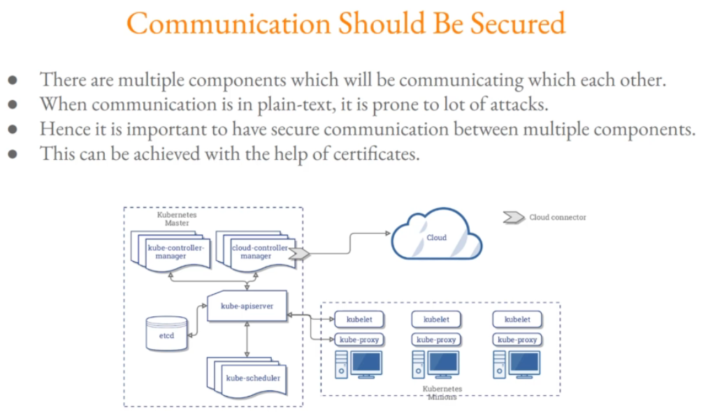
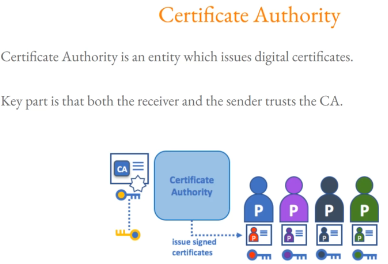

#### Step 1 - Creating a private key for Certificate Authority:
```sh
mkdir /root/certificates
cd /root/certificates
```
```sh
openssl genrsa -out ca.key 2048
ls -ltar
    -rw------- 1 root root 1675 Oct 18 12:52 ca.key

```
#### Step 2 -  Creating CSR:
```sh
openssl req -new -key ca.key -subj "/CN=KUBERNETES-CA" -out ca.csr
ls -ltar
-rw------- 1 root root 1675 Oct 18 12:52 ca.key
-rw-r--r-- 1 root root  895 Oct 18 12:53 ca.csr

```
#### Step 3 - Self-Sign the CSR:
```sh
openssl x509 -req -in ca.csr -signkey ca.key -CAcreateserial  -out ca.crt -days 1000
ls -ltar
-rw------- 1 root root 1675 Oct 18 12:52 ca.key
-rw-r--r-- 1 root root  895 Oct 18 12:53 ca.csr
-rw-r--r-- 1 root root 1001 Oct 18 12:54 ca.crt
```
#### Step 4 - Remove the CSR
```sh
rm -f ca.csr
```
