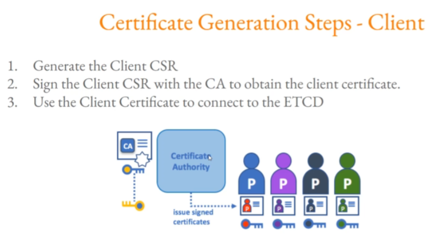

### ETCD Security - Client Authentication




#### Step 1 - Generate Client Certificate and Client Key:
```sh
cd /root/certificates
openssl genrsa -out client.key 2048
openssl req -new -key client.key -subj "/CN=client" -out client.csr
openssl x509 -req -in client.csr -CA ca.crt -CAkey ca.key -CAcreateserial -out client.crt -extensions v3_req  -days 1000

root@ip-172-31-18-204:~/certificates# ls -ltar
-rw------- 1 root root 1675 Oct 18 12:52 ca.key
-rw-r--r-- 1 root root 1001 Oct 18 12:54 ca.crt
-rw------- 1 root root 1679 Oct 18 13:28 etcd.key
-rw-r--r-- 1 root root  277 Oct 18 13:31 etcd.cnf
-rw-r--r-- 1 root root  972 Oct 18 13:32 etcd.csr
-rw-r--r-- 1 root root 1066 Oct 18 13:34 etcd.crt
-rw------- 1 root root 1679 Oct 18 14:09 client.key
-rw-r--r-- 1 root root  887 Oct 18 14:09 client.csr
-rw-r--r-- 1 root root  993 Oct 18 14:09 client.crt
```

#### Step 2 - Start ETCD Server:
```sh
etcd --cert-file=/root/certificates/etcd.crt --key-file=/root/certificates/etcd.key --advertise-client-urls=https://127.0.0.1:2379 --client-cert-auth --trusted-ca-file=/root/certificates/ca.crt  --listen-client-urls=https://127.0.0.1:2379
```
#### Step 3 - Authenticate with Certificates:
```sh
ETCDCTL_API=3 etcdctl --endpoints=https://127.0.0.1:2379 --insecure-skip-tls-verify  --insecure-transport=false --cert /root/certificates/client.crt --key /root/certificates/client.key put course "kplabs is awesome!"

ETCDCTL_API=3 etcdctl --endpoints=https://127.0.0.1:2379 --insecure-skip-tls-verify  --insecure-transport=false --cert /root/certificates/client.crt --key /root/certificates/client.key get course
```
