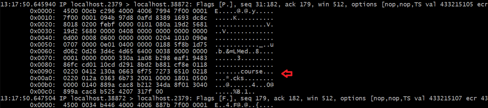

#### Step 1 - Install utilities
```sh
apt-get -y install tcpdump net-tools
```

#### Step 2 - Capture Plain Text ETCD Traffic

First tab:
```sh
cd /tmp
etcd
```
Second tab:
```sh
root@ip-172-31-18-204:/tmp# ifconfig
eth0: flags=4163<UP,BROADCAST,RUNNING,MULTICAST>  mtu 9001
        inet 172.31.18.204  netmask 255.255.240.0  broadcast 172.31.31.255
        inet6 fe80::8d7:8aff:febc:579b  prefixlen 64  scopeid 0x20<link>
        ether 0a:d7:8a:bc:57:9b  txqueuelen 1000  (Ethernet)
        RX packets 60762  bytes 22422410 (22.4 MB)
        RX errors 0  dropped 0  overruns 0  frame 0
        TX packets 22147  bytes 66176656 (66.1 MB)
        TX errors 0  dropped 0 overruns 0  carrier 0  collisions 0

lo: flags=73<UP,LOOPBACK,RUNNING>  mtu 65536
        inet 127.0.0.1  netmask 255.0.0.0
        inet6 ::1  prefixlen 128  scopeid 0x10<host>
        loop  txqueuelen 1000  (Local Loopback)
        RX packets 1599  bytes 89021 (89.0 KB)
        RX errors 0  dropped 0  overruns 0  frame 0
        TX packets 1599  bytes 89021 (89.0 KB)
        TX errors 0  dropped 0 overruns 0  carrier 0  collisions 0

root@ip-172-31-18-204:/tmp# netstat -plnt
Active Internet connections (only servers)
Proto Recv-Q Send-Q Local Address           Foreign Address         State       PID/Program name
tcp        0      0 0.0.0.0:22              0.0.0.0:*               LISTEN      688/sshd: /usr/sbin
tcp        0      0 127.0.0.1:2379          0.0.0.0:*               LISTEN      13475/etcd
tcp        0      0 127.0.0.1:2380          0.0.0.0:*               LISTEN      13475/etcd
tcp        0      0 127.0.0.53:53           0.0.0.0:*               LISTEN      418/systemd-resolve
tcp6       0      0 :::22                   :::*                    LISTEN      688/sshd: /usr/sbin
root@ip-172-31-18-204:/tmp# tcpdump -i lo -X  port 2379
tcpdump: verbose output suppressed, use -v or -vv for full protocol decode
listening on lo, link-type EN10MB (Ethernet), capture size 262144 bytes
13:15:19.135379 IP localhost.45740 > localhost.2379: Flags [.], ack 3943100300, win 512, options [nop,nop,TS val 433063594 ecr 433048490], length 0
        0x0000:  4500 0034 9c83 4000 4006 a03e 7f00 0001  E..4..@.@..>....

```
Third tab:
```sh
etcdctl put course "cks"
etcdctl get course
```
In TCP dump terminal:



#### Step 2 - Creating the ETCD Certificate Key:
```sh
cd /root/certificates
openssl genrsa -out etcd.key 2048
```
#### Step 3 - Find the IP of your server

```sh
ifconfig
# Note down the local IP address
```

#### Step 4 - Creating Configuration for ETCD CSR:
```sh
cat > etcd.cnf <<EOF
[req]
req_extensions = v3_req
distinguished_name = req_distinguished_name
[req_distinguished_name]
[ v3_req ]
basicConstraints = CA:FALSE
keyUsage = nonRepudiation, digitalSignature, keyEncipherment
subjectAltName = @alt_names
[alt_names]
IP.1 = 172.31.18.204
IP.2 = 127.0.0.1
EOF

root@ip-172-31-18-204:~/certificates# ls -ltar
-rw------- 1 root root 1675 Oct 18 12:52 ca.key
-rw-r--r-- 1 root root 1001 Oct 18 12:54 ca.crt
-rw------- 1 root root 1679 Oct 18 13:28 etcd.key
-rw-r--r-- 1 root root  277 Oct 18 13:31 etcd.cnf

```
#### Step 4 - Creating CSR:
```sh
openssl req -new -key etcd.key -subj "/CN=etcd" -out etcd.csr -config etcd.cnf

root@ip-172-31-18-204:~/certificates# ls -ltar
-rw------- 1 root root 1675 Oct 18 12:52 ca.key
-rw-r--r-- 1 root root 1001 Oct 18 12:54 ca.crt
-rw------- 1 root root 1679 Oct 18 13:28 etcd.key
-rw-r--r-- 1 root root  277 Oct 18 13:31 etcd.cnf
-rw-r--r-- 1 root root  972 Oct 18 13:32 etcd.csr
```
#### Step 4 - Signing CSR with Certificate Authority Certificate:
```sh
openssl x509 -req -in etcd.csr -CA ca.crt -CAkey ca.key -CAcreateserial -out etcd.crt -extensions v3_req -extfile etcd.cnf -days 1000

root@ip-172-31-18-204:~/certificates# ls -ltar
-rw------- 1 root root 1675 Oct 18 12:52 ca.key
-rw-r--r-- 1 root root 1001 Oct 18 12:54 ca.crt
-rw------- 1 root root 1679 Oct 18 13:28 etcd.key
-rw-r--r-- 1 root root  277 Oct 18 13:31 etcd.cnf
-rw-r--r-- 1 root root  972 Oct 18 13:32 etcd.csr
-rw-r--r-- 1 root root 1066 Oct 18 13:34 etcd.crt
```


#### Step 5 - Start ETCD Server with Certificates:
```sh
etcd --cert-file=/root/certificates/etcd.crt --key-file=/root/certificates/etcd.key --advertise-client-urls=https://127.0.0.1:2379 --listen-client-urls=https://127.0.0.1:2379
```

#### Step 6 - Verify
```sh
root@ip-172-31-18-204:~# etcdctl put course "cks"
{"level":"warn","ts":"2023-10-18T13:41:00.600Z","logger":"etcd-client","caller":"v3/retry_interceptor.go:62","msg":"retrying of unary invoker failed","target":"etcd-endpoints://0xc0002e2a80/127.0.0.1:2379","attempt":0,"error":"rpc error: code = DeadlineExceeded desc = latest balancer error: last connection error: connection closed"}
Error: context deadline exceeded
```

#### Run TCPDUMP to capture Traffic:
```sh
tcpdump -i lo -X  port 2379
```

#### Step 6 - 
```sh
ETCDCTL_API=3 etcdctl --endpoints=https://127.0.0.1:2379 --insecure-skip-tls-verify  --insecure-transport=false put course "cks"

ETCDCTL_API=3 etcdctl --endpoints=https://127.0.0.1:2379 --insecure-skip-tls-verify  --insecure-transport=false get course
```
