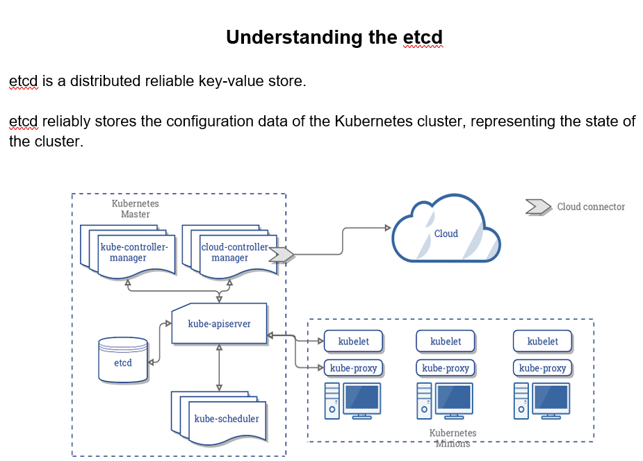
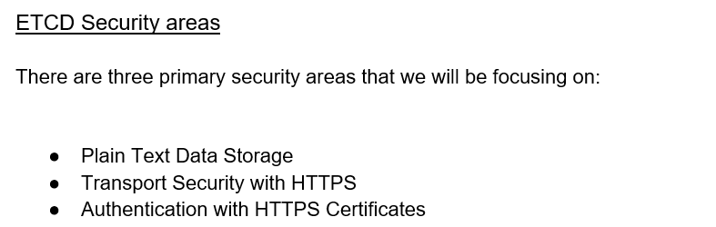
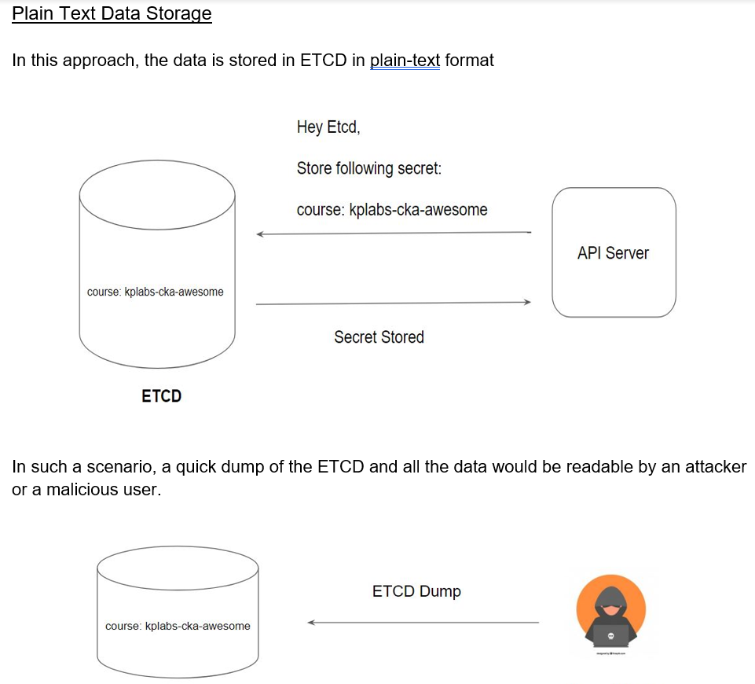
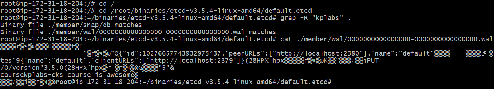

#### Documentation Link:

https://github.com/etcd-io/etcd/releases/tag/v3.5.4


#### Pre-Requisite:
```sh
sudo -i
apt-get -y install wget
```
#### Step 1: Create the Base Binaries Directory

```sh
mkdir /root/binaries
cd /root/binaries
```
#### Step 2: Download and Copy the ETCD Binaries to Path
```sh
wget https://github.com/etcd-io/etcd/releases/download/v3.5.4/etcd-v3.5.4-linux-amd64.tar.gz
tar -xzvf etcd-v3.5.4-linux-amd64.tar.gz
cd etcd-v3.5.4-linux-amd64
cp etcd etcdctl /usr/local/bin/
```
#### Step 3: Start ETCD from CLI
```sh
etcd
```

#### Step 4: Verification - Adding and Removing Data to ETCD
```sh
# In another terminal
apt install net-tools
netstat -plnt
etcdctl put course "kplabs-cks course is awesome"
```
```sh
etcdctl get course

cd /
cd /root/binaries/etcd-v3.5.4-linux-amd64/default.etcd
grep -R "kplabs" .

 ```



```sh

```

